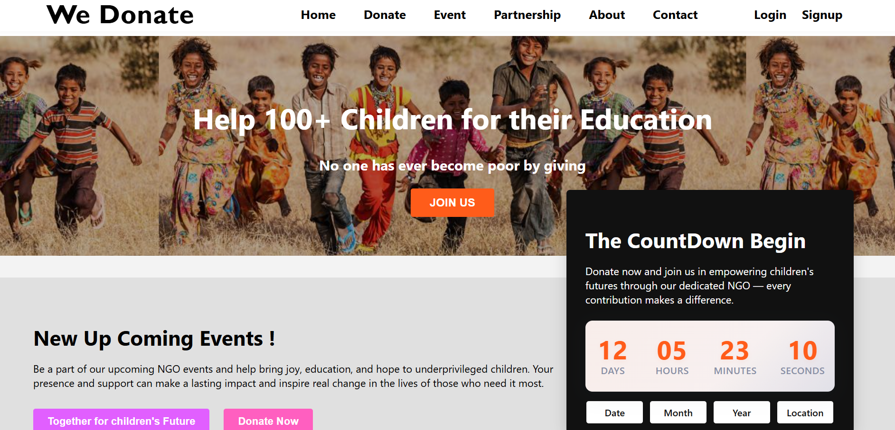
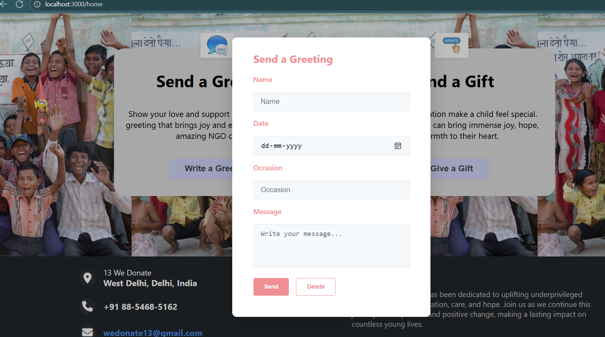
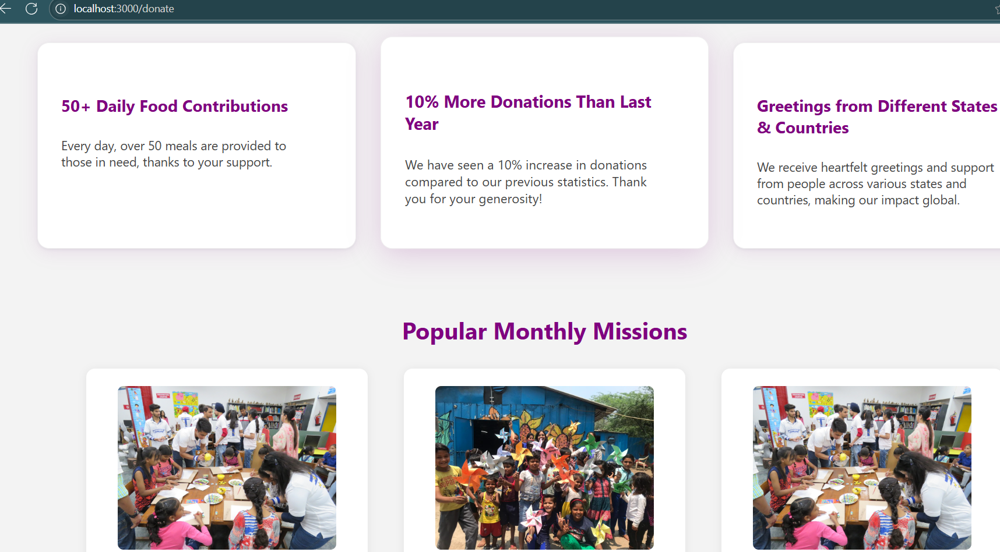
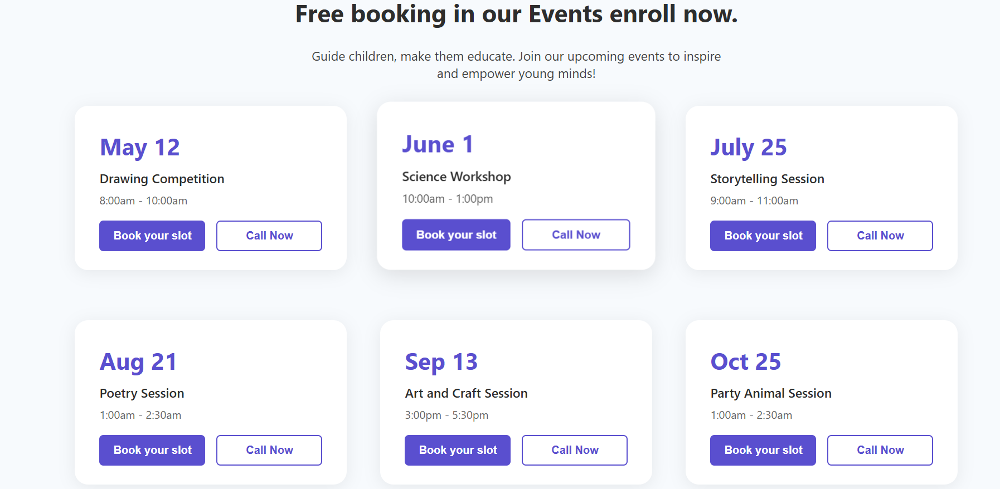
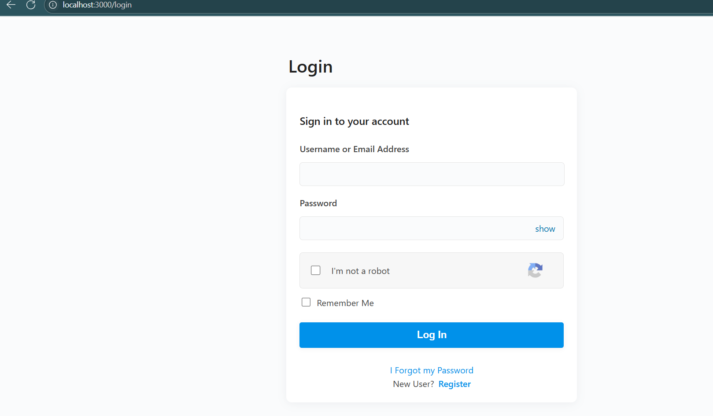
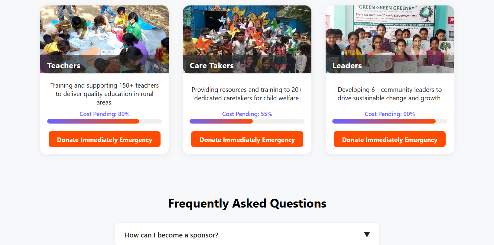

# NGO Website 🌱

A modern, responsive web application for a Non-Governmental Organization (NGO), built using **HTML, CSS, JavaScript, and React**. This project showcases the NGO's initiatives, encourages donations, and allows user engagement through clean design and smooth navigation.

## 🌟 Features

- 🖼️ Responsive UI to display NGO's mission, events, and success stories
- 🔗 Smooth client-side routing using React Router
- 🧭 Intuitive navigation and structured content layout
- 📞 Contact form and partnership page
- 💬 Clean login and signup interface
- 📱 Mobile-friendly design

## 🔧 Tech Stack

- **Frontend:** React, JavaScript
- **Styling:**  HTML, CSS
- **Routing:** React Router DOM

## 🚀 Getting Started

To run the project locally:
```bash
git clone https://github.com/Jasleen-Kaur-123/ngo-react.git
cd ngo-react
npm install
npm start
````

## 📸 Screenshots

### NGO Home Page



### NGO Donation Page


### NGO Partnership Page


### NGO Events Page


### NGO Login Page


### NGO About Page



